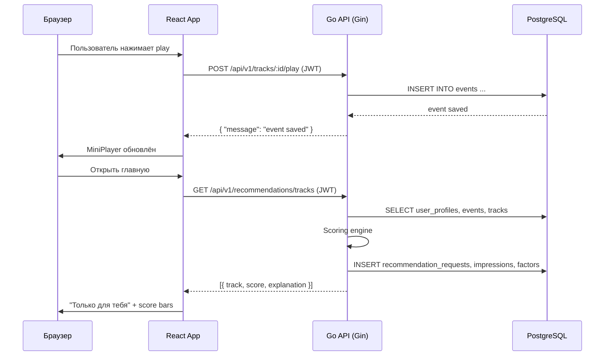
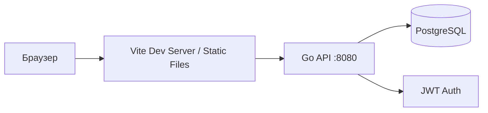
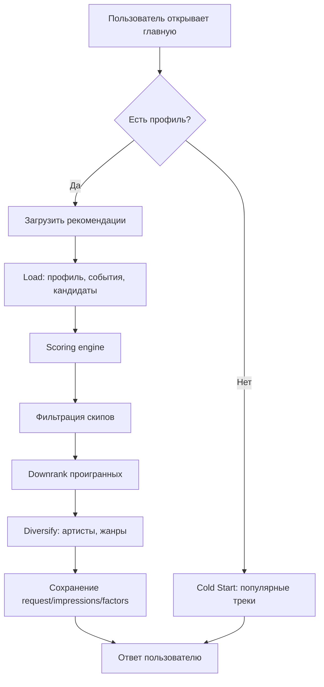

# Архитектура Gudba Music Recommendation

## Цель системы

Gudba Music Recommendation — веб-приложение для персонализированных рекомендаций музыкальных треков на основе предпочтений пользователя. Система собирает данные о музыкальных вкусах через онбординг и поведенческие события (прослушивания, лайки, скипы), на основе которых строит объяснимые рекомендации.

## Пользователи

- **Неавторизованный пользователь** — просматривает каталог треков, плейлистов, жанров и артистов. Не имеет доступа к рекомендациям и персонализации.
- **Авторизованный пользователь** — после регистрации и прохождения онбординга получает персонализированные рекомендации треков и плейлистов. Может оценивать треки (лайк/дизлайк/скип), влияя на будущие рекомендации.
- **Демо-администратор** — может просматривать статистику системы и метрики рекомендаций.

## Ответственности компонентов

### Frontend (React + Vite + TypeScript)

- Рендеринг Spotify-like интерфейса
- Управление состоянием авторизации (AuthContext)
- Управление плеером (PlayerContext)
- Взаимодействие с API через apiClient
- Многошаговый онбординг (4 шага)
- Отображение рекомендаций с объяснениями и score bar

### Backend (Go + Gin)

- REST API с Bearer JWT-аутентификацией
- Бизнес-логика: регистрация, онбординг, события, рекомендации
- In-house recommendation engine (без внешних ML-библиотек)
- Сохранение recommendation_requests, impressions, factors для трассируемости
- Swagger UI для тестирования эндпоинтов

### База данных (PostgreSQL)

- Хранение пользователей, треков, артистов, жанров, плейлистов
- Хранение предпочтений пользователя (user_preferences, user_profiles)
- Хранение событий (events)
- Хранение данных рекомендаций (recommendation_requests, impressions, factors)
- Миграции через встроенный инструмент (cmd/migrate)

## Поток запроса

## Рекомендательный flow

## Выбор стека

| Компонент | Технология | Обоснование |
|-----------|-----------|-------------|
| Backend | Go | Простота, производительность, встроенная стандартная библиотека |
| API framework | Gin | Быстрый, легковесный,熟悉ый для дипломных проектов |
| Frontend | React + Vite | Компонентный подход, быстрый HMR, TypeScript |
| БД | PostgreSQL | JSONB для гибких профилей, надёжность, встроенные агрегации |
| Аутентификация | Custom JWT | Полный контроль над реализацией, без внешних зависимостей |
