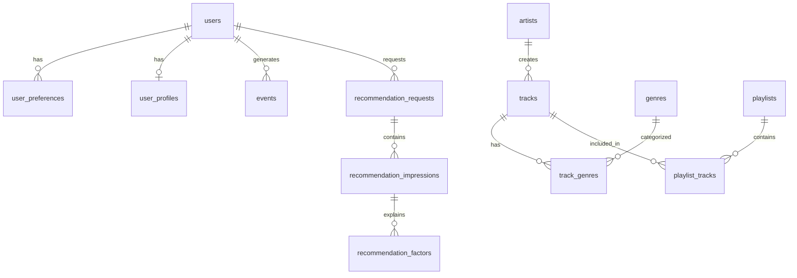

# Схема базы данных

## Обзор

База данных состоит из 14 таблиц, разделённых на функциональные группы:
- Каталог: genres, artists, tracks, track_genres, playlists, playlist_tracks
- Пользователи: users
- Предпочтения: user_preferences, user_profiles
- События: events
- Рекомендации: recommendation_requests, recommendation_impressions, recommendation_factors
- Системные: schema_migrations

## ER-диаграмма

## Таблицы

### users
Хранение учётных записей. Пароль хранится в виде bcrypt-хэша. Поле `email` уникально.
- Связана с: user_preferences, user_profiles, events, recommendation_requests

### genres
Справочник музыкальных жанров. Заполняется через seed-миграцию (10 жанров).
- Связана с: track_genres (m2m с tracks)

### artists
Справочник исполнителей. Заполняется через seed-миграцию (20 артистов).
- Связана с: tracks

### tracks
Основная единица контента. Каждый трек принадлежит одному артисту и может относиться к нескольким жанрам через track_genres.
- Поле `popularity_score` (0–100) используется в scoring engine
- Seed: 41 трек

### track_genres
Связь многие-ко-многим между tracks и genres. Составной первичный ключ.

### playlists
Подборки треков. Seed: 7 плейлистов (6 публичных, 1 приватный).
- Поле `is_public` определяет видимость

### playlist_tracks
Связь многие-ко-многим между playlists и tracks с позицией (position).

### user_preferences
Хранит предпочтения пользователя, выбранные во время онбординга.
- `preference_type`: genre | artist | track | context
- `reference_id`: ID жанра/артиста/трека (NULL для context)
- `value`: значение контекста ("focus", "relax", etc.)
- При повторном онбординге старые предпочтения удаляются и заменяются новыми в одной транзакции

### user_profiles
Денормализованный кэш профиля пользователя для быстрого доступа в recommendation engine.
- JSONB-поля: favorite_genre_ids, favorite_artist_ids, starter_track_ids, contexts
- Обновляется при каждом онбординге через UPSERT

### events
Поведенческие события: прослушивания (play), лайки (like), дизлайки (dislike), скипы (skip), открытия плейлистов (open).
- Индекс по (user_id, created_at DESC) для быстрой выборки последних событий
- Используется в recommendation engine для recent_interest и фильтрации скипов

### recommendation_requests
Фиксирует каждый запрос рекомендаций для трассируемости.
- `request_type`: tracks | playlists

### recommendation_impressions
Результаты рекомендаций — какие треки/плейлисты были рекомендованы, с какой оценкой и объяснением.
- Связана с: recommendation_factors

### recommendation_factors
Детализация оценки: какие факторы (genre_match, artist_match, popularity, recent_interest) и с каким весом повлияли на итоговый score.
- Позволяет объяснить пользователю, почему рекомендован конкретный трек

### schema_migrations
Системная таблица для отслеживания применённых миграций.
- Не предназначена для прямого редактирования
